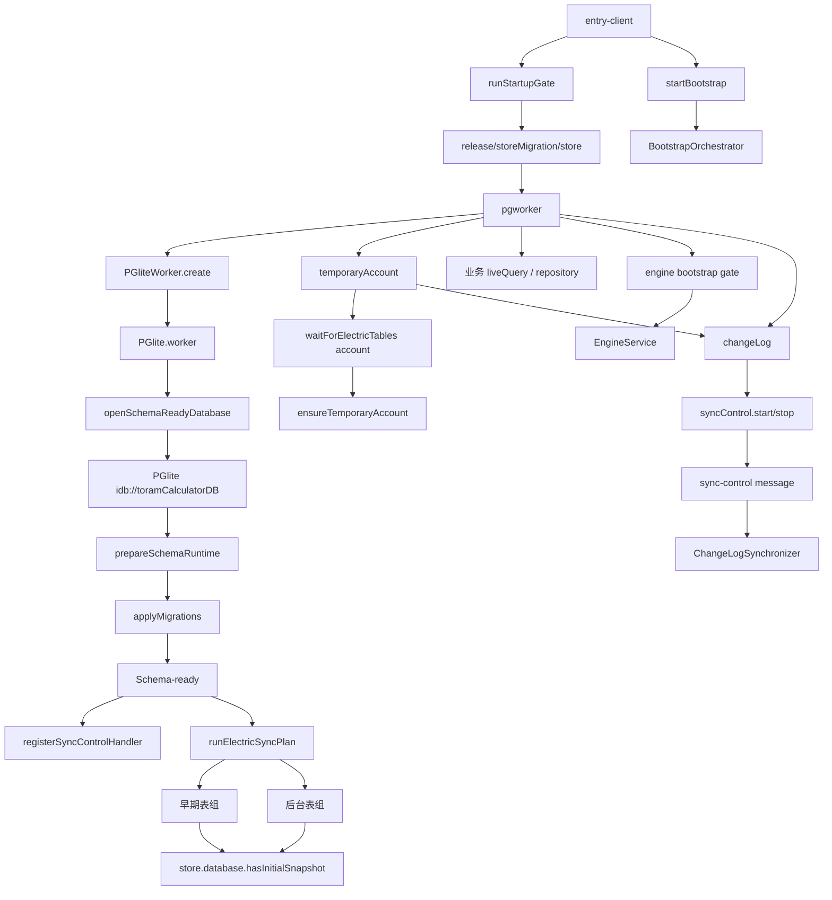

# 相关概念

- startBootstrap：浏览器入口唯一触发点，创建并启动应用级 BootstrapOrchestrator。
- BootstrapOrchestrator：按依赖拓扑并行启动应用模块，管理 ready、error、skipped 和超时状态。
- PGlite Worker：在独立 Worker 中打开 idb:// 本地数据库，完成 schema 准备、迁移和可查询边界。
- Schema-ready：PGlite 已完成本地 schema 迁移并通过版本校验，但不代表远端数据已完成首轮同步。
- Electric 首轮同步：按早期和后台表组注册远端 shape，并通过主线程 store 标记各表初始快照完成。
- 本地临时账号：等待 account 表首轮同步后创建或补齐本地匿名账号。
- ChangeLog 写入同步：在 PGlite 和临时账号就绪后，根据 store.database.sync 状态启动或停止本地变更上传。

# 关系图

# 导航锚点

- code | 浏览器入口与唯一 Bootstrap 触发点 | `src/entry-client.tsx`
- code | 应用级 Bootstrap 单例入口 | `src/platform/bootstrap/context-standalone.ts`
- code | 依赖拓扑、超时和状态编排 | `src/platform/bootstrap/orchestrator.ts`
- code | PGlite、Electric、账号和同步模块定义 | `src/platform/bootstrap/modules.ts`
- code | PGliteWorker 单例与主线程代理 | `src/platform/dataQuery/pg.ts`
- code | PGlite Worker 初始化、迁移和 Electric 同步计划 | `src/worker/PGlite.worker.ts`
- code | 表级首轮同步 readiness 门闩 | `src/platform/bootstrap/electricReadiness.ts`
- code | 本地临时账号补齐入口 | `src/platform/session/temporaryAccount.ts`
- code | 本地变更写入同步器 | `src/platform/writeSync/ChangeLogSynchronizer.ts`
- document | 应用启动流程文档 | `src/platform/bootstrap/预期的启动流程.md`
- test | 本地数据收敛验证 | `src/platform/dataQuery/localFirstConvergence.test.ts`
- test | PGlite live 查询验证 | `src/platform/dataQuery/liveBusinessView.test.ts`
- test | ChangeLog 同步验证 | `src/platform/writeSync/ChangeLogSynchronizer.test.ts`
