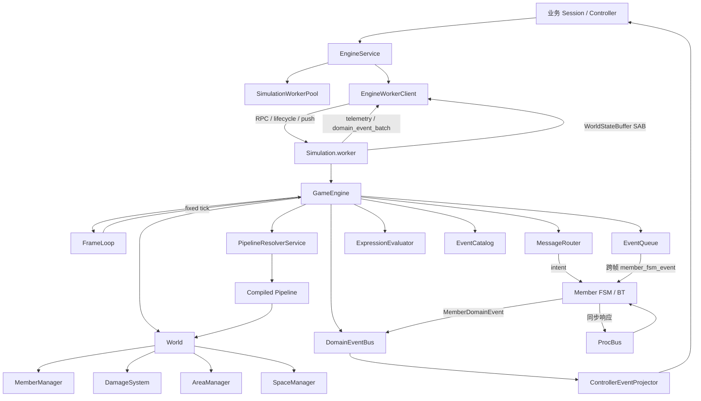

# 相关概念

- EngineService：主线程非业务引擎基础设施，显式启动和关闭 SimulationWorkerPool，并按 Session 申请、管理和回收实时 Worker Handle。
- GameEngine：Worker 内单个模拟实例，聚合 World、FrameLoop、EventQueue、MessageRouter、Pipeline/Expression、事件目录和域事件投影，维护模拟时间、tick、checkpoint 与运行产出。
- World：场景运行容器，聚合 MemberManager、SpaceManager、DamageSystem 和 AreaManager；每个逻辑 tick 按成员更新、瞬时伤害结算、持续区域更新的顺序推进。
- FrameLoop：实时会话时钟，将 monotonic real time 经 timeScale 和 catch-up 限制转换为固定步长 tick；timer 只负责唤醒，不作为模拟时间事实源。
- EventQueue：唯一跨帧调度器，按模拟时间分桶并将到期消息投递给成员 FSM；不承担发布订阅或 UI 投影。
- ProcBus：成员内部同步响应机制，由 passive/buff 对已注册事件进行发布订阅响应；属于成员运行时边界，不与 EventQueue 或 DomainEventBus 混用。
- DomainEventBus：成员到 UI/控制器的单向投影通路，按 tick 合并同类 MemberDomainEvent 后交给 ControllerEventProjector。
- PipelineCatalog 与 PipelineResolverService：计算管线的定义和解析执行边界；Resolver 按 member/world overlay 顺序合成指令、生成 signature，并缓存编译后的 closure。
- EventCatalog：可订阅事件的扁平目录，按稳定排序分配 bit 索引并用 Zod schema 校验 payload，为 ProcBus 订阅 mask 和 checkpoint 稳定性提供契约。
- Worker 协议与 WorldStateBuffer：主线程和模拟 Worker 之间的类型化 RPC、生命周期/遥测/域事件推送，以及面向实时读取的共享状态布局与缓冲区。
- GameEngineSM：控制端和 Worker 共同使用的 XState 生命周期协议，约束 idle、ready、running、paused 等稳定状态和带 correlationId 的生命周期命令结果匹配。

# 关系图

# 导航锚点

- code | 引擎总编排入口 | `src/engine/core/GameEngine.ts`
- code | 主线程引擎服务与 Worker 资源生命周期 | `src/engine/core/thread/EngineService.ts`
- code | 单实时 Worker 客户端、RPC 与推送接收 | `src/engine/core/thread/EngineWorkerClient.ts`
- code | Worker 启动与模拟实例边界 | `src/engine/core/thread/Simulation.worker.ts`
- code | 场景成员、伤害和区域的 tick 编排 | `src/engine/core/World/World.ts`
- code | 实时到固定步长的时钟转换 | `src/engine/core/FrameLoop/FrameLoop.ts`
- code | 跨帧 FSM 消息调度队列 | `src/engine/core/EventQueue/EventQueue.ts`
- code | 成员到 UI/控制器的域事件投影总线 | `src/engine/core/DomainEvents/DomainEventBus.ts`
- code | 计算管线 overlay、signature 和编译缓存 | `src/engine/core/Pipeline/PipelineResolverService.ts`
- code | 可订阅事件目录、bit 索引和 payload 校验 | `src/engine/core/Event/EventCatalog.ts`
- code | Worker RPC、生命周期、推送与共享状态协议 | `src/engine/core/thread/protocol.ts`
- code | 引擎运行配置、tick 上下文与基础设施契约 | `src/engine/core/types.ts`
- directory | 引擎完整实现范围 | `src/engine/`
- directory | 引擎设计文档与历史说明 | `src/engine/document/`
- test | GameEngine 生命周期与行为验证 | `src/engine/core/GameEngineSM.test.ts`
- test | FrameLoop 固定步长和状态验证 | `src/engine/core/FrameLoop/FrameLoop.test.ts`
- test | EventQueue 调度和 checkpoint 验证 | `src/engine/core/EventQueue/EventQueue.test.ts`
- test | World 场景更新验证 | `src/engine/core/World/World.test.ts`
- test | Worker 服务、池和协议验证 | `src/engine/core/thread/EngineService.test.ts`
- test | Worker 协议与传输边界验证 | `src/engine/core/thread/protocol.test.ts`
- test | 运行产出端到端验证 | `src/engine/core/runOutput.integration.test.ts`
- document | 引擎文档导航与权威性边界 | `src/engine/document/README.md`
- document | 引擎总体设计意图 | `src/engine/document/架构设计说明概要.md`
- document | 主线程与 Worker 通信说明 | `src/engine/document/通信协议表.md`
- command | 运行引擎相关测试 | `pnpm vitest run src/engine/core`
- command | 项目类型检查 | `pnpm typecheck`
