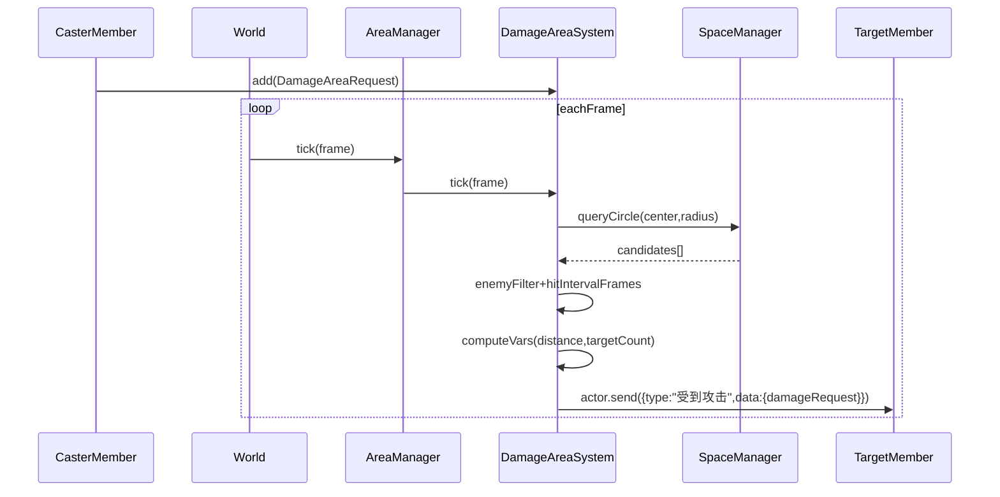

# World Area 子系统设计（伤害区域/陷阱/放置技能/Buff光环与Buff区域）

本文档描述 World 中“跨帧实体”的统一承载方式，用于实现伤害区域、陷阱、放置类持续技能（如风暴），以及 Buff 光环与 Buff 区域类效果。

## 背景与原则

### 分布式伤害（核心约束）
- **施法者侧**：在构造伤害请求时，解析伤害表达式并将 `self.*` 相关变量替换为自身属性数值，再把“编译后的表达式/产物”装入请求。
- **世界侧**：仅负责“跨帧区域更新、空间命中、派发 DamageRequest”，不负责 self 侧数值求值。

### 设计原则（KISS）
- `SpaceManager` 只做几何查询/索引，不承载业务规则。
- World 内容保持简洁：World 只调度 `AreaManager.tick(frame)`。
- 不同语义分离：
  - 伤害区域：事件态 + 命中节流（每 N 帧可再次命中）
  - Buff 光环/区域：集合态 + enter/exit（进入加，离开移除）或持续刷新（按 tick 保持/刷新）

## 总体结构

### World 调度位置
`World.tick(frame)` 内已调用 `areaManager.tick(frame)`，Area 子系统固定在这里推进。

### 组件拆分（AreaManager 作为调度壳）
- `AreaManager`
  - `DamageAreaSystem`
  - `TrapAreaSystem`
  - `BuffAreaSystem`

`AreaManager` 仅做生命周期调度与统一入口组织，具体规则在子系统内。

## 职责划分

### SpaceManager（纯空间查询）
- 提供 `queryCircle(center, radius)` 等查询能力，返回候选 members/areas。
- 不做敌我判断、不做命中策略、不做事件派发。

### DamageAreaSystem（伤害区域）
- 管理多个 `DamageAreaInstance`（跨帧实体）。
- 每帧对每个实例：
  1. 更新轨迹（trajectory）并得到当前中心点
  2. 按 shape（目前为 circle）调用 `SpaceManager` 查询候选目标
  3. 过滤：**仅敌方阵营生效**
  4. 命中节流：同目标 **每 N 帧**允许再次命中（N=hitIntervalFrames）
  5. 动态变量注入（最小集）：`distance`、`targetCount`
  6. 直接派发到目标：`target.actor.send({ type: "受到攻击", data: { damageRequest } })`

### BuffAreaSystem（Buff 光环与 Buff 区域）
Buff 不只有光环（跟随施法者），也存在“放置在世界中的 buff 区域”（例如结界、领域、风暴内获得状态等）。两者都可以由同一个系统承载。

#### 共同点（集合态）
- 每帧计算“范围内成员集合”，并维护 `insideSet`（或 `lastSeenFrameByTargetId`）。

#### 语义 A：enter/exit（进入加、离开移除）
- enter：派发“添加 buff”
- exit：派发“移除 buff”
- 适合：结界守护、领域类状态、区域内增益/减益等。

#### 语义 B：持续刷新（按 tick 保持/刷新）
- 每 tick 或每 N 帧对 inside 目标派发“刷新/延长 buff”或“重置持续时间”。
- 适合：需要稳定维持、且离开后自然过期/衰减的效果。

两种语义可共存：通过请求参数决定该 buff 实例采用 enter/exit 还是持续刷新。

### TrapAreaSystem（陷阱/放置技能）
- 与伤害区域相似但规则不同（触发次数/激活延等）。
- 先作为空壳接口存在，后续逐步填充规则。

## 伤害区域抽象

### 伤害区域只对敌方生效
本阶段不考虑 ally/any/self，`DamageAreaInstance` 只需要基于 `sourceCampId` 做 enemy 过滤。

### shape / trajectory 由范围类型决定（实例公共属性）
为了让上层 `GlobalActions.*Attack` 只负责构造请求、保持简单，使用高层枚举来描述范围类型：
- `rangeKind: "single" | "range" | "surroundings" | "move" | "custom"`
- `rangeParams: { radius?; speed?; dir?; ... }`

实例构造时将 `rangeKind/rangeParams` 具体化为：`shape` 与 `trajectory`（作为实例公共属性持有）。

### 范围类型映射（已确认语义）
- `surroundingsAttack`（原 enemyAttack）
  - 以施法者当前位置为中心的圆
  - `shape=circle(radius)`；`trajectory=static(centerSource="caster")`
- `rangeAttack`
  - 以目标为中心的圆，**落点锁定**
  - `shape=circle(radius)`；`trajectory=static(center=target.position_at_cast)`
- `moveAttack`
  - 圆（基于成员半径）在线段上移动
  - `shape=circle(radius=memberRadius)`；`trajectory=linear(start=castPosition, dir, speed)`
- `singleAttack`
  - 可选择不走 area（直接对目标派发一次 DamageRequest），或视为 radius=0 的特殊 range（后续实现时再定）

## Attack 语义（关键约定）
每个 Attack 行为触发一次完整的判定流程（暴击/命中/格挡等）。\n
- `attackCount`：单次判定结果重复利用的次数（多次属性修正）。\n
- `damageCount`：单次判定结果被均分为多少份属性修正。\n

因此：在 `DamageAreaSystem` 派发给目标侧的 payload 中，应携带 `attackCount` 与 `damageCount`，由受击者侧的结算管线按约定消费。

## 数据结构与接口（最小可行）

### DamageAreaRequest（施法者侧构造并 add）
- identity
  - `sourceId: string`
  - `sourceCampId: string`
- lifetime
  - `startFrame: number`
  - `durationFrames: number`
- hitPolicy
  - `hitIntervalFrames: number`（同目标命中节流 N）
- attackSemantics
  - `attackCount: number`
  - `damageCount: number`
- range
  - `rangeKind: ...`
  - `rangeParams: ...`
- payload
  - `compiledDamageExpr: string | CompiledExpression`（先以 string 占位）
  - `selfBindings?: Record<string, number | string | boolean>`（可选）
- dynamicVars
  - 固定支持：`distance`、`targetCount`

### DamageDispatchPayload（派发给受击者）
- `sourceId`
- `areaId`
- `compiledDamageExpr`
- `attackCount`
- `damageCount`
- `vars: { distance: number; targetCount: number }`

### 子系统统一接口（add/remove/tick）
为统一世界内“区域实体集合管理”语义，Area 子系统接口统一为：
- `add(request): id`
- `remove(id): void`
- `tick(frame): void`
- （可选）`removeBySource(sourceId): void`

## 运行流程

## 实现落点（建议）
- 调度入口：`src/components/features/simulator/core/World/World.ts`
- 调度壳：`src/components/features/simulator/core/World/AreaManager.ts`
- 子系统建议新增：
  - `src/components/features/simulator/core/World/DamageAreaSystem.ts`
  - `src/components/features/simulator/core/World/BuffAreaSystem.ts`
  - `src/components/features/simulator/core/World/TrapAreaSystem.ts`（先空壳）
  - `src/components/features/simulator/core/World/types.ts`（Vec3、request/payload、rangeKind/params）

## TODO（仅设计拆解，不在本文档内实现）
- 定义 `DamageAreaRequest`/`DamageDispatchPayload` 与 rangeKind/params（types.ts）
- AreaManager 组合并 tick 三个子系统
- DamageAreaSystem：enemy-only + hitIntervalFrames + distance/targetCount 注入 + actor.send 派发
- BuffAreaSystem：enter/exit insideSet 或持续刷新（按 tick）+ add/remove buff 派发
- TrapAreaSystem：空壳接口稳定调度结构

